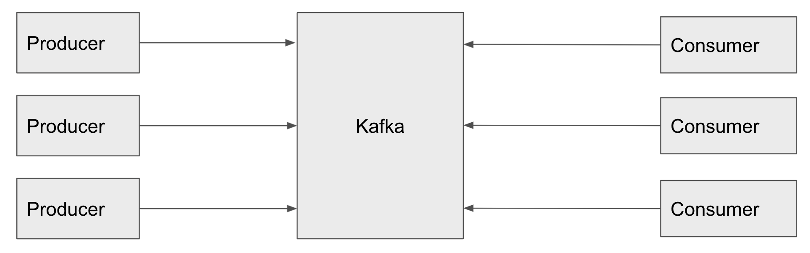

# introduce

`Producer` : Kafka 에 event 를 쓰는 client applications

`Consumer` : Kafka 의 event 를 구독하는 client applications

Kafka 에서는 Producer 와 Consumer 는 완전히 분리되어있다. 

높은 확장성을 달성하기 위함이다.

Producer 는 Consumer 를 기다릴 필요가 없다.