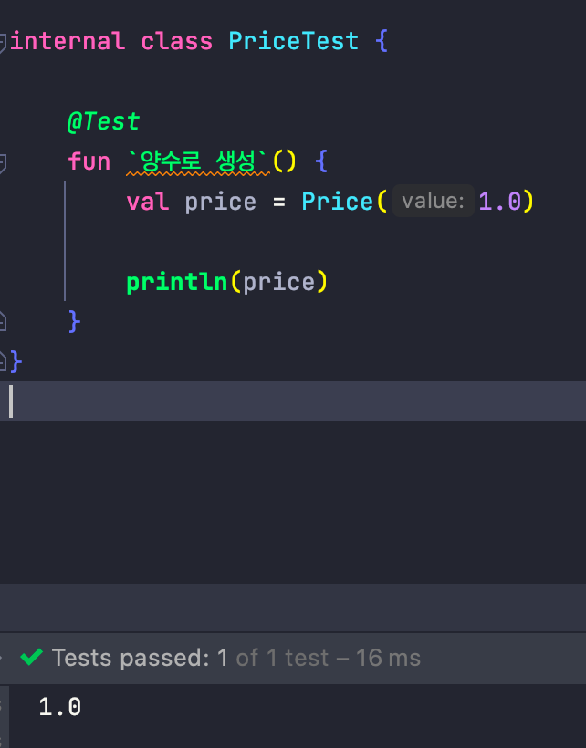

# factory-function-with-private-constructor

객체를 생성할 때 유효성검사를 해야할 때가 있다.

다양한 방법이 있겠지만 이번 글에서는 팩토리 함수와 비공개 생성자를 이용한 방법을 소개하도록 하겠다.

먼저 객체를 만들때 생성자를 private constructor 로 선언한다.

```kotlin
data class Price private constructor(
    private val value: Double
)
```

그 후 팩토리 함수를 추가한다.

kotlin 에서 invoke 는 특별한 형태의 함수로 생성자와 같은 모양으로 호출이 가능하다.

예를들어 아래의 invoke는 Price(1.0) 과 같은 형태로 호출이 가능하다.

```kotlin
data class Price private constructor(
    private val value: Double
){
    override fun toString(): String {
        return value.toString()
    }

    companion object {

        operator fun invoke(value: Double): Price {
            if( value > 0 )
                return Price(value)
            else
                throw IllegalArgumentException("Price must be positive or null")
        }
    }
}
```

위와 같은 클래스를 만들고 양수와 음수를 인자로 넘겼을 때 아래와 같은 결과를 받을 수 있다.

### 양수



### 음수


참고 : 코틀린을 다루는 기술
